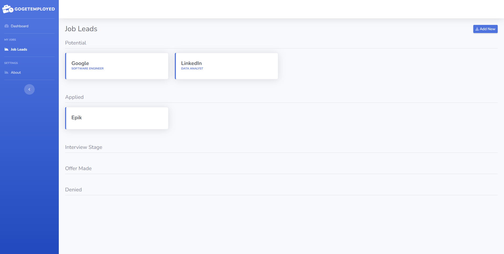

# GoGetEmployed
> A self-hosted job application tracker built with Go, Gin and Bootstrap.

*UPDATE: This won Best Solo Project at [UGAHacks7](https://devpost.com/software/gogetemployed)!*

GoGetEmployed allows you to organize job applications and store information like the company's name, the role, the job description, the job listing's URL, and miscellaneous notes. You're also able to break job leads down into categories. GoGetEmployed has the following sections on the Job Leads page: Potential, Applied, Interview Stage, Offer Made, and Denied.

## Installation

    $ go get github.com/brackson/gogetemployed

## How to Run

    $ cd gogetemployed
    $ go run .

## Screenshots

